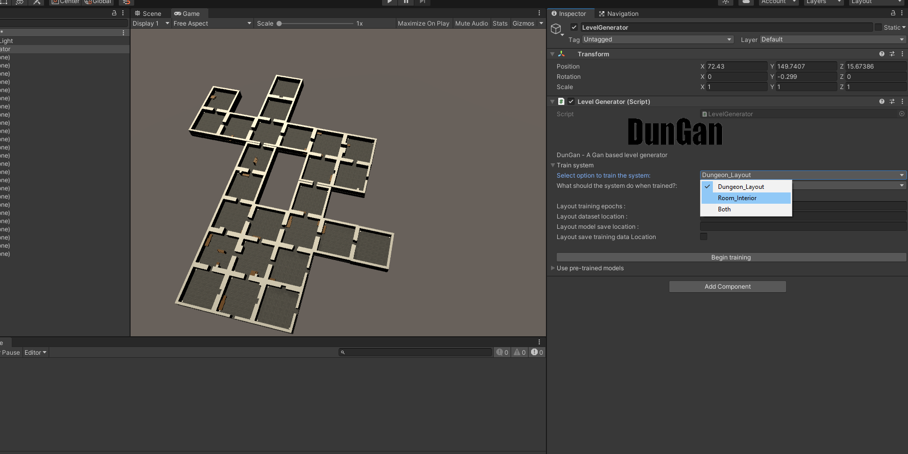

# Generative (gan) based level generator

<b> project outline </b>
Developed as part of my masters thesis. 
This project looks to see if it's possible to use gans to generate a fully playable 3d level, It does this by attempting to build a simple dungeon crawler/roguelike level.

Two things are included in this project 

1) A *simple* roguelike inspired by games such as Binding of Isaac/netrunner/the original rogue game.

2) A unity editor tool to generate levels.

<b> My contribution</b>

Solo developed with guidence from my supervisor.

<b>Screenshots</b>

<b>playable build links</b>

Project source files unfortunatly due to file size limits the project is hosted on gdrive

https://drive.google.com/file/d/19kBNbucj6iR_6MHyF9HZjrmnXtU5oRjL/view?usp=sharing
 