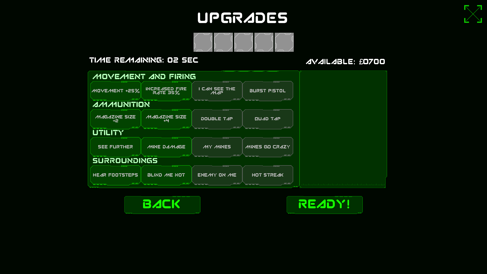

# Red vs Blue

<b> project outline </b>
This project is a 5v5 networked first person death match, inspired by classic games such as counter strike.

<b> My contribution</b>

This project was developed over 2 months with a 3 man development team of 2 programmers and 1 designer.

<ul>
  <li>gun mechanics</li>
  <li>implemented the upgrades as directed by the designer</li>
  <li>multiple other gameplay elements</li>
  <li>In game animations</li>
  <li>Level design</li>
  <li>3d throwable elements such as the grenade models</li>
</ul> 

<b>Screenshots</b>

<b>playable build links</b>
 
Unfortunatly due to file size the projects source files are hosted on a Gdrive <b>however a playable build can be downloaded from above</b>:
 
Playable build (493mb):- https://drive.google.com/file/d/18yir_9meZfRUIzYLqfxGO_ZGT6wyR2bn/view?usp=sharing
 
Project source files(2.47gb):- https://drive.google.com/file/d/1UNYZX4oC1VAwE_jKct64iqOlsaNFxslc/view?usp=sharing
 