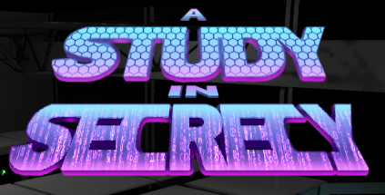
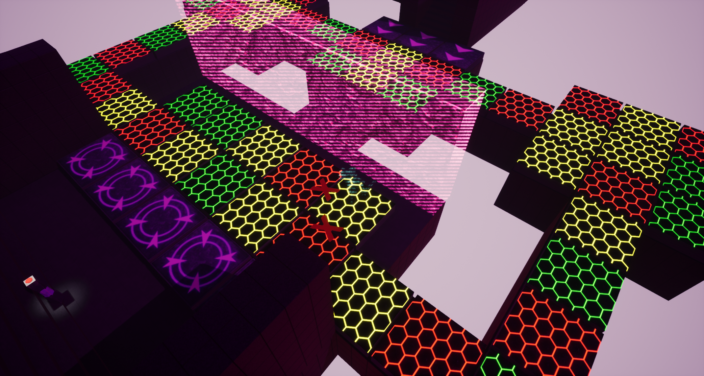
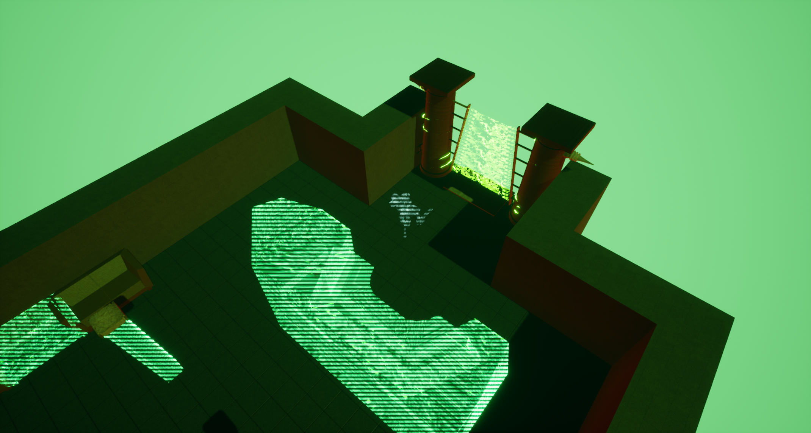
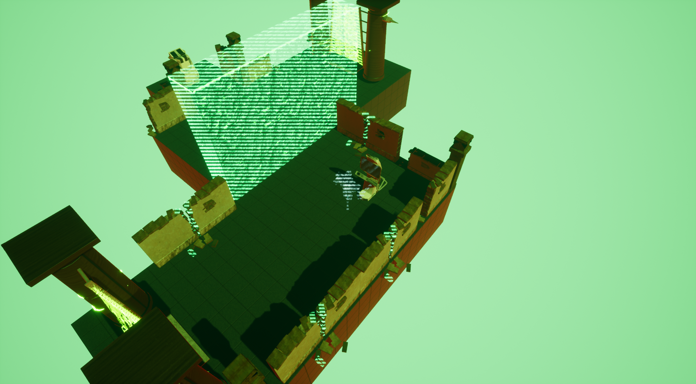

# A study in secrecy

  

<b>plot the game </b>

A study in secrecy is a procedurally generated sci-fi puzzle game, where the player acts as a hacker trying to break in to the servers of 1 of 3 mega-corporations and steal the data found within. Dispite having one accademic 
year to develop this project, it did suffer from a cronic lack of an animator forcing us to cut corners

<b>My contribution </b>

 Officially my role on this project was 'Junior developer', in terms of development team there was 2 developers (me and a senior) and 8 artists.

<ul>
  <li>Developed the procedural generation system that underpins the entire game as my entire </li>
  <li>Occasional puzzle room design</li>
  <li>A number of QOL things that got cut such as post level generation cut scene systems</li>
  <li>Implimented a bunch of the in game flavour text from prompts provided by the lead developer</li>
</ul>  

 	
<b>Screenshots</b>
 
 
 
<b>playable build links</b>
Unfortunatly due to file size playable builds and sources are hosted on a Gdrive :

Playable build :- https://drive.google.com/file/d/1OqCvum34lHAzVvtlcli8qXlpQBDPLvgB/view?usp=sharing 
 
Source files :- 

<b>Extra</b>
A trailer was put together for this project:-
 
<video width="320" height="240" controls>
  <source src="A Study in Secrecy game trailer.mp4" type="video/mp4">

  Your browser does not support the video tag.
</video>
