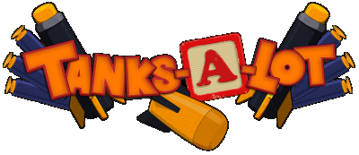

# Tanks-A-Lot

  

<b>plot the game </b>

Tanks-A-Lot is a party game in which the players control small cartoon-style tanks in various gamemodes including Capture the Flag, Deathmatch, and others.
This project was completed over a small two week prototyping period and then a seven week stretch for finalisation.

<b>My contribution </b>
<ul>
  <li>Developed the procedural generation system that underpins the entire game as my entire </li>
  <li>Occasional puzzle room design</li>
  <li>A number of QOL things that got cut such as post level generation cut scene systems</li>
  <li>Implimented a bunch of the in game flavour text from prompts provided by the lead developer</li>
</ul>  
<b>Screenshots</b>
<b>playable build links</b>
<b>Extra</b>