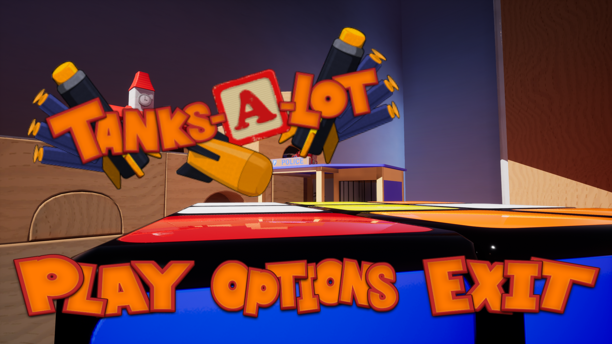
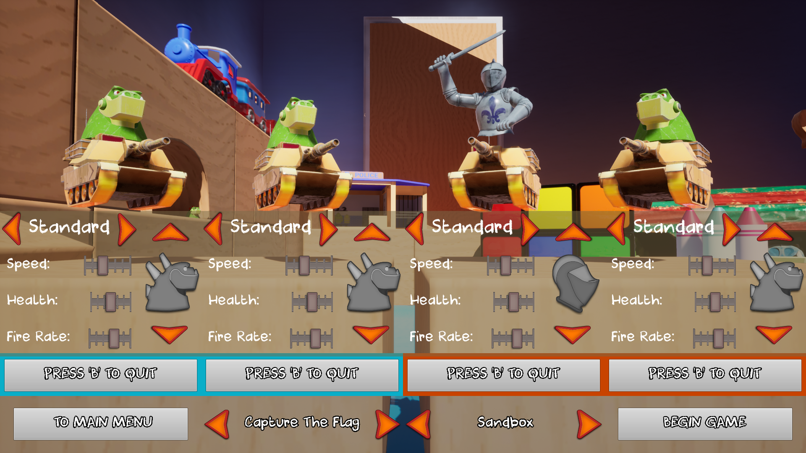
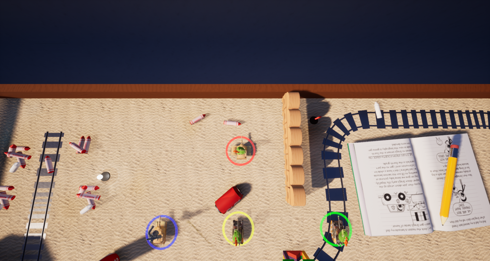

# Tanks-A-Lot

  

<b>plot the game </b>

Tanks-A-Lot is a party game in which the players control small cartoon-style tanks in various gamemodes including Capture the Flag, Deathmatch, and others.
This project was completed over a small two week prototyping period and then a seven week stretch for finalisation.

<b>My contribution </b>

In this project I acted as a senior developer so in addition to developing major aspects of the project I also had a group of 3 junior developers whom I was responsible for mentoring.

<ul>
  <li>Investigate the feasibility of having lan multiplayer</li>
  <li>Rebuilding the tank controls/handling based off player feedback </li>
  <li>Level design where needed</li>
  <li>Managing and assigning tasks to a sub team of 3 junior developers</li>
</ul>  
<b>Screenshots</b>

 
 
<b>playable build links</b>
Unfortunatly due to file size playable builds and sources are hosted on a Gdrive :
 
Playable build (493mb):- https://drive.google.com/file/d/18yir_9meZfRUIzYLqfxGO_ZGT6wyR2bn/view?usp=sharing
 
Project source files(2.47gb):- https://drive.google.com/file/d/1UNYZX4oC1VAwE_jKct64iqOlsaNFxslc/view?usp=sharing
 
<b>Extra</b>